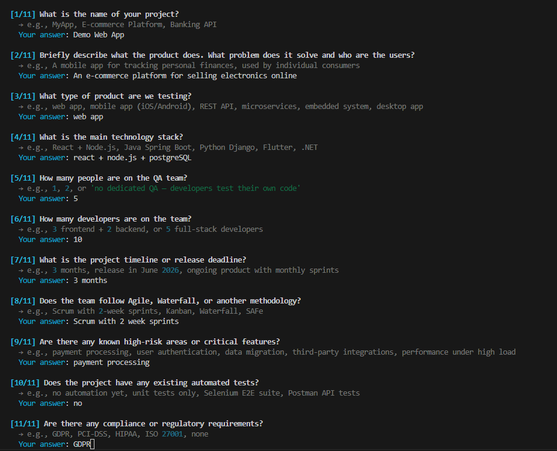
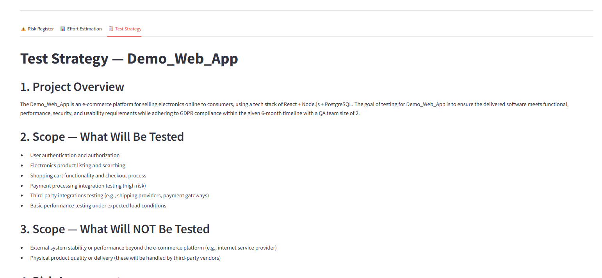

# QAI Consultant

An open-source AI agent that acts as a senior QA Architect — automatically generating a **Test Strategy**, **Risk Register**, and **Effort Estimation Report** from a simple project description.

> 100% local. No API keys. No cloud. Powered by [Ollama](https://ollama.ai) + [Mistral](https://mistral.ai).


---

## Screenshots

<!-- TODO: Add screenshots before making repo public -->
<!--  -->
<!--  -->

---

## Quick Start

```bash
# 1. Install Ollama (https://ollama.ai) and pull the model
ollama pull mistral:7b-instruct-q4_0   # 4-bit quantized — ~3x faster on CPU

# 2. Clone and install
git clone https://github.com/yourusername/qai-consultant.git
cd qai-consultant
pip install -r requirements.txt

# 3. Build the knowledge base (one-time, 5-10 min)
python src/ingest.py

# 4. Run
python src/cli.py            # Terminal UI
streamlit run src/app.py     # Web UI → http://localhost:8501
```

> 📖 Full installation guide: [INSTALL.md](INSTALL.md)

---

## The Problem

Creating a Test Strategy from scratch is time-consuming and requires deep QA expertise. Most teams either skip it, do it superficially, or spend days researching methodologies.

QAI Consultant eliminates this bottleneck by combining established QA methodologies, industry standards (ISTQB, OWASP, ISO 26262, A-SPICE), and expert knowledge into an AI agent that thinks like a seasoned QA Architect.

---

## Who Is This For?

- **QA Engineers** who need structured guidance on test strategy
- **Engineering Managers** who need effort estimations and resource planning
- **Development teams** without a dedicated QA Architect
- **QA Consultants** who want to accelerate their delivery

---

## What QAI Consultant Generates

From a single 11-question dialogue, QAI Consultant automatically generates **three documents**:

| Document | What it contains |
|---|---|
| ⚠️ **Risk Register** | Risk matrix, likelihood/impact analysis, mitigations per risk |
| 📊 **Effort Estimation Report** | PERT-based breakdown, team capacity analysis, risk buffer |
| 📋 **Test Strategy** | Full strategy document backed by ISTQB, OWASP, ISO standards |

All outputs are saved as Markdown files and available for download.

---

## Knowledge Base

QAI Consultant's recommendations are grounded in real QA standards and methodologies:

- 📘 **ISTQB** — 14 certification syllabuses (CTFL, CTAL-TA, CTAL-TM, CTAL-TAE, CT-AI, and more)
- 🔒 **OWASP** — WSTG v4.2, MASTG, Top 10 2021
- 🚗 **ISO 26262** — Automotive functional safety (ASIL levels, HARA, V&V)
- 🏭 **A-SPICE** — Automotive SPICE process reference model (SWE.4, SWE.5, SWE.6)
- 📋 **IEEE 829** — Test documentation standard
- ⚙️ **ISO/IEC 25010** — Software product quality model
- 🧠 **Expert Knowledge** — Real QA scenarios and lessons learned from practitioners

---

## Prerequisites

### 1. Install Ollama

Download and install Ollama from [ollama.ai](https://ollama.ai), then pull the quantized model:

```bash
ollama pull mistral:7b-instruct-q4_0   # 4-bit quantized — ~3x faster on CPU than float16
```

### 2. Verify Ollama is running

```bash
curl http://localhost:11434
# Expected: Ollama is running
```

---

## Getting Started

```bash
# 1. Clone the repository
git clone https://github.com/yourusername/qai-consultant
cd qai-consultant

# 2. Install dependencies
pip install -r requirements.txt

# 3. Build the knowledge base (one-time setup, ~5-10 min)
python src/ingest.py

# 4. Run — choose your preferred interface:
python src/cli.py                 # Terminal UI
streamlit run src/app.py          # Web UI → http://localhost:8501
```

---

## How It Works

```
You describe your project (11 questions)
        ↓
QAI analyzes risks from your context
        ↓
QAI estimates effort using PERT + industry benchmarks
        ↓
QAI generates a Test Strategy backed by QA standards
        ↓
Three documents ready for download
```

---

## Interfaces

### CLI (Terminal)

Beautiful terminal experience with `rich`:

```bash
python src/cli.py
```

### Web UI (Browser)

Streamlit interface with three output tabs:

```bash
streamlit run src/app.py
```

---

## Feedback Loop

After each generation, QAI asks: *"Was this strategy useful?"*

- **Yes** → strategy saved to `knowledge_base/generated_strategies/` and included in the next re-ingestion
- **Partially** → strategy saved with your improvement notes
- **No** → discarded

This creates a **feedback loop** where QAI learns from validated real-world outputs over time.

---

## Roadmap

- **v0.1** ✅ Core agent + CLI + Streamlit Web UI
- **v0.2** ✅ Feedback loop — validated strategies grow the knowledge base
- **v0.3** ✅ Risk Register — automatic risk analysis alongside Test Strategy
- **v0.4** ✅ Effort Estimation Report — PERT-based with team capacity analysis
- **v0.5** ✅ Auto re-ingest — file watcher + incremental ingest + manifest tracking
- **v0.6** ✅ Confidence level algorithm — score-based (0-100): PERT spread + capacity gap + data quality + multiplier magnitude
- **v0.7** HuggingFace integration — `download_knowledge_base.py` so users don't need to build KB manually
- **v0.8** Community knowledge — launch LinkedIn Poll Series (10 polls ready) + run expert knowledge extraction sessions using prompts in `knowledge_base/expert_knowledge/`
- **v1.0** MVP — polish, stability, full documentation, easy local setup (clone → download KB → run)
- **v2.0** HuggingFace integration — easy KB download for new users
- **v2.1** Community knowledge — LinkedIn Poll Series + expert knowledge extraction sessions
- **v3.0** Hosted version — shared KB, quality gate, VPS deployment
- **v4.0** Multi-LLM support (OpenAI, Claude API, Gemini, and more)

---

## Contributing

QAI Consultant is built by the QA community, for the QA community.

Contributions are welcome:
- 📚 Add new knowledge sources to `knowledge_base/`
- 🧠 Share expert knowledge using the prompts in `knowledge_base/expert_knowledge/`
- 🐛 Report bugs or suggest features via GitHub Issues
- 🔧 Submit pull requests

See [CONTRIBUTING.md](CONTRIBUTING.md) for detailed guidelines.

---

## Troubleshooting

| Problem | Solution |
|---|---|
| "Ollama is not running" | Run `ollama serve` in a separate terminal |
| "Model 'mistral:7b-instruct-q4_0' not found" | Run `ollama pull mistral:7b-instruct-q4_0` |
| "Knowledge base not found" | Run `python src/ingest.py` |
| Slow generation (>1 min) | Normal on first call — model loading into memory; subsequent calls are faster |
| Windows encoding errors | Set `PYTHONIOENCODING=utf-8` before running |

> 📖 Full troubleshooting guide: [INSTALL.md](INSTALL.md#troubleshooting)

